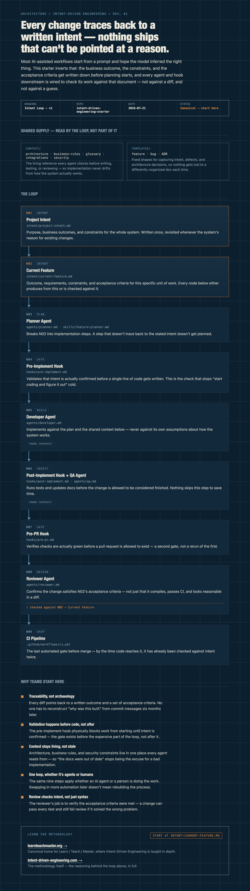
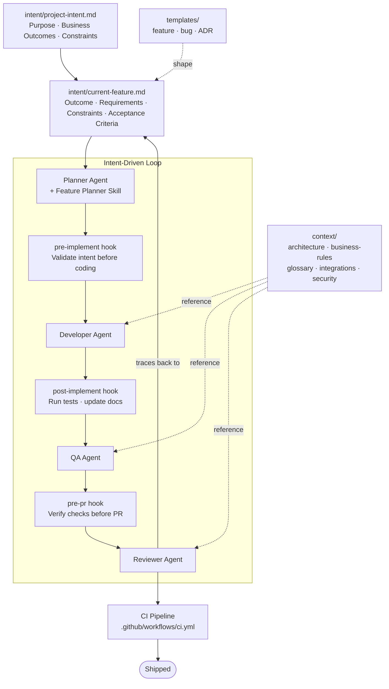

# Intent-Driven Engineering Starter

**This is the canonical starting point for Intent-Driven Engineering.**

Most AI coding workflows start with a prompt and hope the model infers what you meant. Intent-Driven Engineering flips that: you write the *intent* down first — the business outcome, the constraints, the acceptance criteria — and every agent, hook, and check in this repo is built to read that intent before it touches code. Nothing gets planned, implemented, or reviewed without first being traced back to a stated intent.

Learn the methodology in depth at **[learnteachmaster.org](https://learnteachmaster.org)** and **[intent-driven-engineering.com](https://intent-driven-engineering.com)**.

## The core loop

1. **State the intent.** Every feature starts in [`intent/current-feature.md`](intent/current-feature.md) — business outcome, requirements, constraints, acceptance criteria. The project-level version lives in [`intent/project-intent.md`](intent/project-intent.md).
2. **Plan against it.** The [Planner agent](agents/planner.md) and the [feature-planner skill](skills/feature-planner.md) break the stated intent into implementation steps — nothing gets planned that isn't traceable to the intent doc.
3. **Validate before coding.** The [`pre-implement`](hooks/pre-implement.md) hook checks that intent is actually validated before the [Developer agent](agents/developer.md) writes a line of code.
4. **Implement against shared context.** The developer works against the living reference docs in [`context/`](context/) — architecture, business rules, glossary, integrations, security — so implementation never drifts from how the system actually works.
5. **Verify.** The [QA agent](agents/qa.md) and the [`post-implement`](hooks/post-implement.md) hook run tests and update docs before anything is considered done.
6. **Review against intent, not just diff.** The [Reviewer agent](agents/reviewer.md) and the [`pre-pr`](hooks/pre-pr.md) hook verify the change actually satisfies the original acceptance criteria before a PR goes out.
7. **Ship.** CI ([`.github/workflows/ci.yml`](.github/workflows/ci.yml)) is the last gate.

[Templates](templates/) (feature, bug, ADR) exist so intent, defects, and architecture decisions are always captured in the same shape.

## Architecture

[View the interactive version](docs/architecture.html) (open locally, or enable GitHub Pages on this repo to serve it live).

Every arrow into the loop originates from a stated intent, and every exit from the loop (QA, review, CI) checks back against that same intent — not just against the diff.

Mermaid source (renders inline on GitHub)

## Getting started

1. Fill out [`intent/project-intent.md`](intent/project-intent.md) with your project's purpose, business outcomes, and constraints.
2. For each new feature, fill out [`intent/current-feature.md`](intent/current-feature.md) before writing any code.
3. Let the agents in [`agents/`](agents/) and the hooks in [`hooks/`](hooks/) carry the feature through planning, implementation, QA, and review.
4. Keep [`context/`](context/) current — it's the shared source of truth every agent reads from.

## Learn more

- **[learnteachmaster.org](https://learnteachmaster.org)** — canonical home for Learn/Teach/Master and where Intent-Driven Engineering is taught in depth.
- **[intent-driven-engineering.com](https://intent-driven-engineering.com)** — the methodology itself, in detail.
